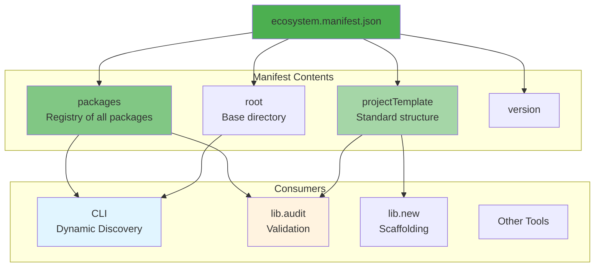
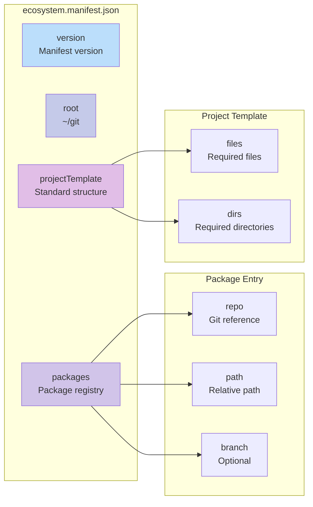

# @mark1russell7/ecosystem

[](https://www.npmjs.com/package/@mark1russell7/ecosystem)
[](https://opensource.org/licenses/MIT)

> Ecosystem manifest - source of truth for all @mark1russell7 packages

## Overview

`@mark1russell7/ecosystem` provides the central manifest file (`ecosystem.manifest.json`) that serves as the single source of truth for all packages in the `@mark1russell7` ecosystem. It includes TypeScript utilities for reading the manifest and accessing package metadata.

### Key Features

- **Central Package Registry**: Single JSON file listing all ecosystem packages
- **Type-Safe Access**: TypeScript utilities for querying the manifest
- **Project Templates**: Defines standard structure for all packages
- **Discovery Integration**: Powers CLI and tooling discovery mechanisms
- **Path Resolution**: Utilities to resolve package paths from home directory

## Architecture



## Installation

```bash
npm install @mark1russell7/ecosystem
```

Or from GitHub:

```bash
npm install github:mark1russell7/ecosystem#main
```

### Prerequisites

- Node.js >= 25.0.0
- npm >= 11.0.0

## Manifest Structure

The `ecosystem.manifest.json` file has the following structure:

```json
{
  "version": "1.0.0",
  "root": "~/git",
  "packages": {
    "@mark1russell7/cue": {
      "repo": "github:mark1russell7/cue#main",
      "path": "cue"
    },
    "@mark1russell7/cli": {
      "repo": "github:mark1russell7/cli#main",
      "path": "cli"
    }
  },
  "projectTemplate": {
    "files": [
      "package.json",
      "tsconfig.json",
      "dependencies.json",
      ".gitignore"
    ],
    "dirs": [
      "src",
      "dist"
    ]
  }
}
```

### Manifest Fields



| Field | Type | Description |
|-------|------|-------------|
| `version` | string | Manifest version |
| `root` | string | Root directory for all packages (supports `~`) |
| `packages` | object | Map of package name to package entry |
| `projectTemplate` | object | Standard structure all packages must follow |

### Package Entry

| Field | Type | Description |
|-------|------|-------------|
| `repo` | string | Git repository reference (e.g., `github:mark1russell7/cue#main`) |
| `path` | string | Path relative to root (e.g., `cue` or `docker/sqlite`) |
| `branch` | string | Optional branch name (defaults to `main`) |

### Project Template

| Field | Type | Description |
|-------|------|-------------|
| `files` | string[] | Required files every package must have |
| `dirs` | string[] | Required directories every package must have |

## API Reference

### Types

#### `EcosystemManifest`

The complete manifest structure:

```typescript
interface EcosystemManifest {
  version: string;
  root: string;
  packages: Record<string, PackageEntry>;
  projectTemplate: ProjectTemplate;
}
```

#### `PackageEntry`

A single package entry:

```typescript
interface PackageEntry {
  repo: string;
  path: string;
  branch?: string;
}
```

#### `ProjectTemplate`

Project structure template:

```typescript
interface ProjectTemplate {
  files: string[];
  dirs: string[];
}
```

#### `PackageName`

Type alias for package names:

```typescript
type PackageName = string;
```

#### `GitRef`

Type alias for Git references:

```typescript
type GitRef = string;
```

### Functions

#### `manifest`

The loaded ecosystem manifest:

```typescript
import { manifest } from "@mark1russell7/ecosystem";

console.log(manifest.version);
// "1.0.0"

console.log(manifest.root);
// "~/git"
```

#### `getPackageNames(): string[]`

Get all package names in the ecosystem:

```typescript
import { getPackageNames } from "@mark1russell7/ecosystem";

const names = getPackageNames();
// [
//   "@mark1russell7/cue",
//   "@mark1russell7/cli",
//   "@mark1russell7/ecosystem",
//   ...
// ]
```

#### `getPackage(name: string): PackageEntry | undefined`

Get a package entry by name:

```typescript
import { getPackage } from "@mark1russell7/ecosystem";

const pkg = getPackage("@mark1russell7/cue");
// {
//   repo: "github:mark1russell7/cue#main",
//   path: "cue"
// }
```

#### `getRootPath(): string`

Get the root path with `~` expanded:

```typescript
import { getRootPath } from "@mark1russell7/ecosystem";

const root = getRootPath();
// "/Users/mark/git" (on macOS)
// "C:\Users\mark\git" (on Windows)
```

#### `getPackagePath(name: string): string | undefined`

Get the full absolute path for a package:

```typescript
import { getPackagePath } from "@mark1russell7/ecosystem";

const path = getPackagePath("@mark1russell7/docker-sqlite");
// "/Users/mark/git/docker/sqlite"

const unknown = getPackagePath("@mark1russell7/unknown");
// undefined
```

## Usage Examples

### Reading the Manifest

```typescript
import { manifest } from "@mark1russell7/ecosystem";

// Get manifest version
console.log(manifest.version);

// Get number of packages
console.log(Object.keys(manifest.packages).length);

// Check project template
console.log(manifest.projectTemplate.files);
// ["package.json", "tsconfig.json", "dependencies.json", ".gitignore"]
```

### Listing All Packages

```typescript
import { getPackageNames, getPackage } from "@mark1russell7/ecosystem";

const packages = getPackageNames();

for (const name of packages) {
  const pkg = getPackage(name);
  console.log(`${name}: ${pkg?.repo}`);
}
```

### Resolving Package Paths

```typescript
import { getPackagePath, getRootPath } from "@mark1russell7/ecosystem";

// Get full path for a package
const cuePath = getPackagePath("@mark1russell7/cue");
console.log(cuePath);
// "/Users/mark/git/cue"

// Check if package exists
if (getPackagePath("@mark1russell7/my-new-pkg")) {
  console.log("Package exists!");
}

// Manual path construction
const root = getRootPath();
const myPath = `${root}/custom-pkg`;
```

### Validating Package Structure

```typescript
import { manifest } from "@mark1russell7/ecosystem";
import { existsSync } from "node:fs";
import { resolve } from "node:path";

function validatePackage(packagePath: string): boolean {
  const { files, dirs } = manifest.projectTemplate;

  // Check required files
  for (const file of files) {
    if (!existsSync(resolve(packagePath, file))) {
      console.error(`Missing required file: ${file}`);
      return false;
    }
  }

  // Check required directories
  for (const dir of dirs) {
    if (dir === "dist") continue; // Skip dist (created on build)
    if (!existsSync(resolve(packagePath, dir))) {
      console.error(`Missing required directory: ${dir}/`);
      return false;
    }
  }

  return true;
}
```

### Discovery Integration

```typescript
import { manifest, getPackagePath } from "@mark1russell7/ecosystem";
import { readFileSync } from "node:fs";

// Discover all packages with a specific field
const packagesWithProcedures: string[] = [];

for (const [name, entry] of Object.entries(manifest.packages)) {
  const pkgPath = getPackagePath(name);
  if (!pkgPath) continue;

  const packageJson = JSON.parse(
    readFileSync(`${pkgPath}/package.json`, "utf-8")
  );

  if (packageJson.client?.procedures) {
    packagesWithProcedures.push(name);
  }
}

console.log(packagesWithProcedures);
// ["@mark1russell7/client-lib", "@mark1russell7/client-git", ...]
```

## Integration with Ecosystem

The manifest is used by multiple tools and packages:

### CLI Discovery

The CLI reads the manifest to discover procedure packages:

```typescript
// In @mark1russell7/cli
import { manifest, getPackagePath } from "@mark1russell7/ecosystem";

for (const [name, entry] of Object.entries(manifest.packages)) {
  const pkgPath = getPackagePath(name);
  // Load and register procedures...
}
```

### CUE Validation

The `cue-config` tool validates the manifest structure:

```bash
npx cue-config validate-manifest --path ~/git/ecosystem/ecosystem.manifest.json
```

This validates against the CUE schema in `@mark1russell7/cue/ecosystem/schema.cue`.

### Project Structure Validation

Tools use the `projectTemplate` to validate packages:

```bash
npx cue-config validate-structure
```

This checks that a package has all required files and directories.

### Package Scaffolding

The `lib new` command uses the template:

```bash
mark lib new my-package
```

This creates a new package with:
- All files from `projectTemplate.files`
- All directories from `projectTemplate.dirs`
- Registered in `ecosystem.manifest.json`

## Registered Packages

Current packages in the ecosystem:

```mermaid
graph TB
    subgraph "Core Infrastructure"
        CUE[@mark1russell7/cue]
        CLI[@mark1russell7/cli]
        ECO[@mark1russell7/ecosystem]
        LOG[@mark1russell7/logger]
    end

    subgraph "Client Framework"
        CLIENT[@mark1russell7/client]
        SHELL[@mark1russell7/client-shell]
    end

    subgraph "Client Packages"
        CLIB[@mark1russell7/client-lib]
        CGIT[@mark1russell7/client-git]
        CFS[@mark1russell7/client-fs]
        CPNPM[@mark1russell7/client-pnpm]
        CPROC[@mark1russell7/client-procedure]
    end

    subgraph "Database Packages"
        CMONGO[@mark1russell7/client-mongo]
        CSQLITE[@mark1russell7/client-sqlite]
        DMONGO[@mark1russell7/docker-mongo]
        DSQLITE[@mark1russell7/docker-sqlite]
    end

    subgraph "Rendering & UI"
        SPLAY[@mark1russell7/splay]
        SPLAY_R[@mark1russell7/splay-react]
        CSPLAY[@mark1russell7/client-splay]
    end

    style CUE fill:#4caf50
    style CLI fill:#66bb6a
    style ECO fill:#81c784
    style CLIENT fill:#a5d6a7
```

### Package Categories

#### Core Infrastructure (4 packages)

| Package | Description |
|---------|-------------|
| `@mark1russell7/cue` | Configuration management with CUE |
| `@mark1russell7/cli` | Main CLI with dynamic discovery |
| `@mark1russell7/ecosystem` | Manifest and registry |
| `@mark1russell7/logger` | Standalone logging library |

#### Client Framework (2 packages)

| Package | Description |
|---------|-------------|
| `@mark1russell7/client` | Universal RPC client |
| `@mark1russell7/client-shell` | Shell command execution |

#### Procedure Packages (10+ packages)

| Package | Description |
|---------|-------------|
| `@mark1russell7/client-lib` | Package management |
| `@mark1russell7/client-git` | Git operations |
| `@mark1russell7/client-fs` | File system operations |
| `@mark1russell7/client-pnpm` | PNPM operations |
| `@mark1russell7/client-procedure` | Procedure management |
| `@mark1russell7/client-logger` | Logger procedures |
| `@mark1russell7/client-test` | Testing utilities |
| `@mark1russell7/client-vitest` | Vitest integration |

#### Database Packages (4 packages)

| Package | Description |
|---------|-------------|
| `@mark1russell7/client-mongo` | MongoDB procedures |
| `@mark1russell7/client-sqlite` | SQLite procedures |
| `@mark1russell7/docker-mongo` | MongoDB Docker setup |
| `@mark1russell7/docker-sqlite` | SQLite Docker setup |

## Project Template

All packages must conform to this structure:

```
package/
├── src/                    # Source code (required)
│   └── index.ts           # Entry point
├── dist/                   # Build output (created on build)
├── package.json            # Package manifest (required)
├── tsconfig.json           # TypeScript config (required)
├── dependencies.json       # Feature dependencies (required)
└── .gitignore              # Git ignore patterns (required)
```

### Required Files

| File | Description |
|------|-------------|
| `package.json` | NPM package manifest |
| `tsconfig.json` | TypeScript configuration (typically extends from `@mark1russell7/cue`) |
| `dependencies.json` | CUE feature dependencies |
| `.gitignore` | Git ignore patterns |

### Required Directories

| Directory | Description |
|-----------|-------------|
| `src/` | Source code |
| `dist/` | Build output (warning if missing, not error) |

## Development

### Building the Package

```bash
npm run build
```

### Running Tests

```bash
npm test
```

### File Structure

```
ecosystem/
├── src/
│   ├── index.ts         # Main exports
│   ├── manifest.ts      # Manifest loader
│   └── types.ts         # TypeScript types
├── dist/                # Compiled output
├── ecosystem.manifest.json  # The manifest file
└── package.json
```

## CUE Schema

The manifest is validated against a CUE schema located in `@mark1russell7/cue/ecosystem/schema.cue`.

### Schema Structure

```cue
#PackageEntry: {
  repo: string
  path: string
  branch?: string
}

#ProjectTemplate: {
  files: [...string]
  dirs: [...string]
}

#EcosystemManifest: {
  version: string
  root: string
  packages: [string]: #PackageEntry
  projectTemplate: #ProjectTemplate
}
```

## Troubleshooting

### Manifest Not Found

```
Error: Cannot find module '../ecosystem.manifest.json'
```

**Solution:** Ensure `ecosystem.manifest.json` exists in the package root. This file should be included in the published package.

### Invalid Package Name

```typescript
const pkg = getPackage("wrong-name");
// Returns undefined
```

**Solution:** Use exact package names including the `@mark1russell7/` scope:

```typescript
const pkg = getPackage("@mark1russell7/cue"); // Correct
```

### Path Resolution on Windows

The `~` character is expanded correctly on all platforms:

```typescript
// On Windows
getRootPath();
// "C:\Users\mark\git"

// On macOS/Linux
getRootPath();
// "/Users/mark/git"
```

## License

MIT

## Repository

https://github.com/mark1russell7/ecosystem

## Author

Mark Russell <marktheprogrammer17@gmail.com>
